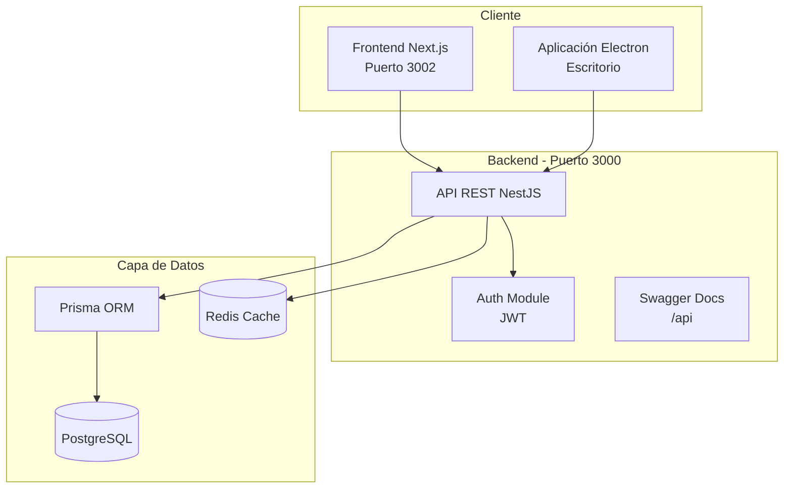
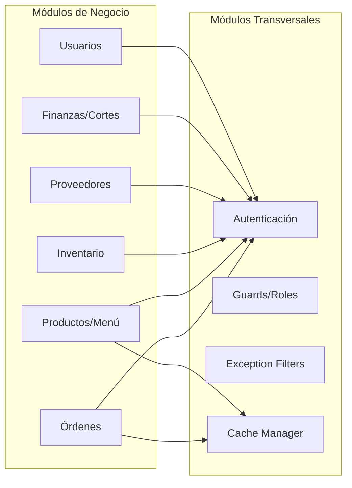
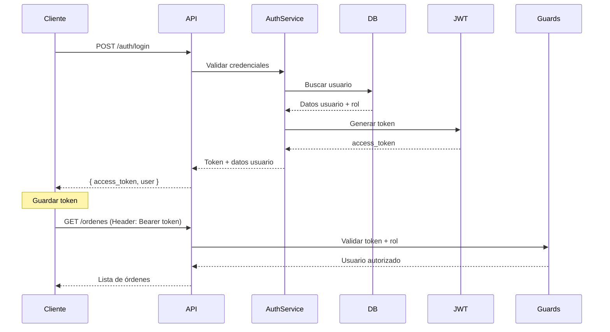
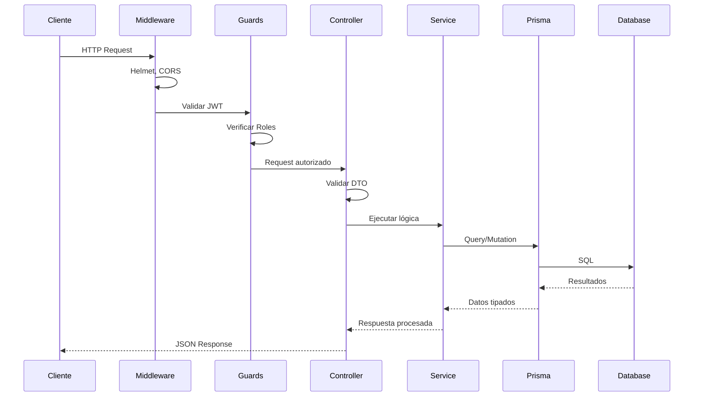
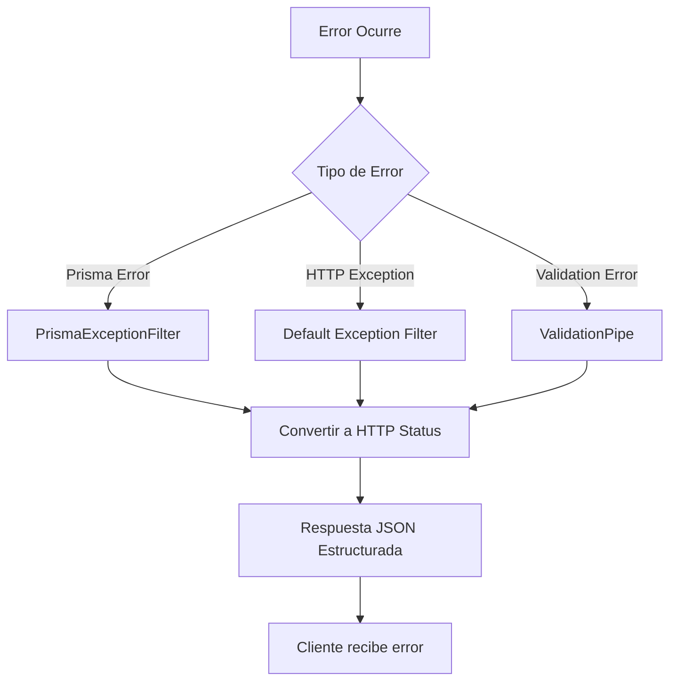

# Diagrama del Sistema

## Arquitectura General



## Arquitectura de Módulos



## Flujo de Autenticación



## Capas de la Aplicación

| Capa                  | Responsabilidad                            | Tecnologías              |
| --------------------- | ------------------------------------------ | ------------------------ |
| **Presentación**      | UI/UX, formularios, navegación             | Next.js, React, Tailwind |
| **API**               | Endpoints REST, validación, autenticación  | NestJS, Guards, Pipes    |
| **Lógica de Negocio** | Reglas de negocio, cálculos, transacciones | Services, DTOs           |
| **Acceso a Datos**    | ORM, queries, migraciones                  | Prisma, PostgreSQL       |
| **Caché**             | Optimización de consultas frecuentes       | Redis, Cache Manager     |

## Estructura de Directorios

```
backend/
├── src/
│   ├── auth/              # Autenticación y autorización
│   ├── ordenes/           # Gestión de órdenes
│   ├── productos/         # Catálogo de productos
│   ├── inventario/        # Control de inventario
│   ├── proveedores/       # Gestión de proveedores
│   ├── usuarios/          # Administración de usuarios
│   ├── common/            # Guards, filters, decorators
│   └── main.ts            # Punto de entrada
├── prisma/
│   └── schema.prisma      # Modelo de datos
└── test/                  # Tests e2e
```

## Seguridad

### Medidas Implementadas

1. **Helmet**: Headers de seguridad HTTP
2. **CORS**: Configuración por variables de entorno
3. **JWT**: Tokens con expiración
4. **Validation Pipes**: Validación de entrada
5. **Role Guards**: Control de acceso basado en roles
6. **Exception Filters**: Manejo centralizado de errores

### Variables de Entorno Críticas

```env
DATABASE_URL=postgresql://...
JWT_SECRET=...
CORS_ORIGIN=http://localhost:3002
REDIS_HOST=localhost
REDIS_PORT=6379
```

## Patrón de Comunicación

### Request/Response Cycle



## Manejo de Errores


