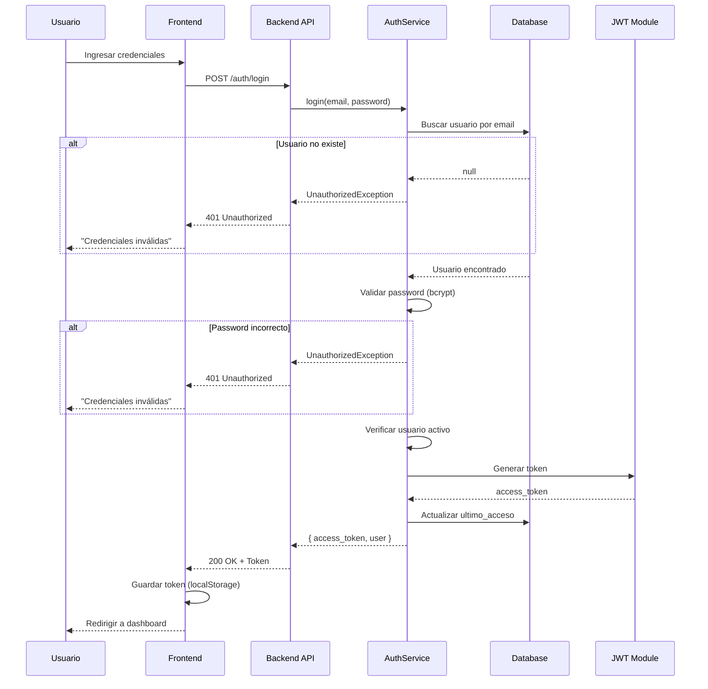
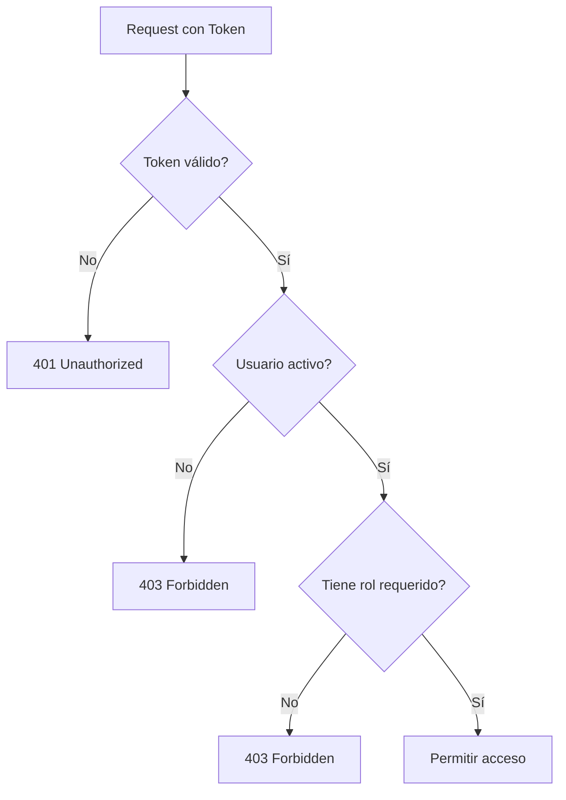
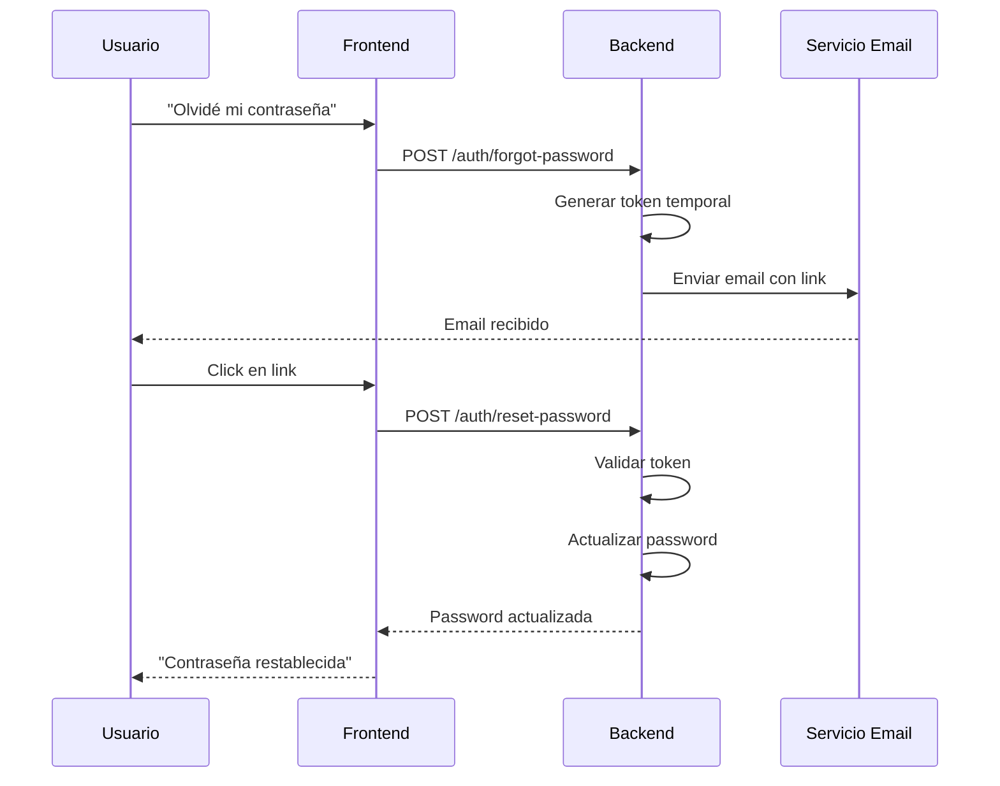

# Proceso de Autenticación

## Descripción General

El sistema de autenticación de KantarEs utiliza JSON Web Tokens (JWT) para gestionar sesiones de usuarios, con control de acceso basado en roles (RBAC - Role-Based Access Control).

## Roles del Sistema

| Rol               | Nivel | Descripción                  | Accesos                                           |
| ----------------- | ----- | ---------------------------- | ------------------------------------------------- |
| **Administrador** | 4     | Control total del sistema    | Todo                                              |
| **Gerente**       | 3     | Gestión operativa y reportes | Órdenes, Inventario, Reportes, Usuarios (lectura) |
| **Cajero**        | 2     | Operaciones de venta y caja  | Órdenes, Productos (lectura), Cortes de caja      |
| **Mesero**        | 1     | Atención a mesas             | Órdenes (crear/consultar)                         |

## Flujo de Autenticación



## Endpoints de Autenticación

### 1. Login

**Endpoint**: `POST /auth/login`

**Request Body**:

```json
{
  "email": "admin@kantares.com",
  "password": "Password123!"
}
```

**Response (200)**:

```json
{
  "access_token": "eyJhbGciOiJIUzI1NiIsInR5cCI6IkpXVCJ9...",
  "user": {
    "id_usuario": 1,
    "nombre": "Juan",
    "apellido": "Pérez",
    "email": "admin@kantares.com",
    "rol": "Administrador",
    "activo": true
  }
}
```

**Errores**:

- `401`: Credenciales inválidas
- `403`: Usuario inactivo

### 2. Verificar Token

**Endpoint**: `GET /auth/me`

**Headers**: `Authorization: Bearer {token}`

**Response (200)**:

```json
{
  "id_usuario": 1,
  "nombre": "Juan",
  "apellido": "Pérez",
  "email": "admin@kantares.com",
  "rol": "Administrador"
}
```

**Errores**:

- `401`: Token inválido o expirado

### 3. Logout (Opcional - Frontend)

El logout se maneja en el frontend simplemente eliminando el token:

```typescript
localStorage.removeItem('access_token');
// Redirigir a /login
```

## Estructura del JWT

### Payload del Token

```json
{
  "sub": 1, // ID del usuario
  "email": "admin@kantares.com",
  "rol": "Administrador",
  "iat": 1728392400, // Issued at
  "exp": 1728478800 // Expiration (24h)
}
```

### Configuración JWT

```typescript
// En .env
JWT_SECRET=tu-secreto-super-seguro-aqui
JWT_EXPIRATION=1d  // 1 día
```

## Guards y Decorators

### 1. JwtAuthGuard

Valida que el token sea válido:

```typescript
@UseGuards(JwtAuthGuard)
@Get('ordenes')
async getOrdenes() {
  // Solo usuarios autenticados
}
```

### 2. RolesGuard

Valida que el usuario tenga el rol requerido:

```typescript
@UseGuards(JwtAuthGuard, RolesGuard)
@Roles('Administrador', 'Gerente')
@Get('reportes/finanzas')
async getReportesFinanzas() {
  // Solo Admin y Gerente
}
```

### 3. Decorator @CurrentUser

Inyecta el usuario actual:

```typescript
@Get('mi-perfil')
async getMiPerfil(@CurrentUser() user: any) {
  return {
    nombre: user.nombre,
    rol: user.rol
  };
}
```

## Matriz de Permisos

| Módulo             | Operación    | Administrador | Gerente             | Cajero               | Mesero            |
| ------------------ | ------------ | ------------- | ------------------- | -------------------- | ----------------- |
| **Órdenes**        | Crear        | ✅            | ✅                  | ✅                   | ✅                |
|                    | Consultar    | ✅            | ✅                  | ✅                   | ✅ (solo propias) |
|                    | Modificar    | ✅            | ✅                  | ✅                   | ✅ (solo propias) |
|                    | Cancelar     | ✅            | ✅                  | ⚠️ (solo pendientes) | ❌                |
| **Productos**      | Crear        | ✅            | ✅                  | ❌                   | ❌                |
|                    | Consultar    | ✅            | ✅                  | ✅                   | ✅                |
|                    | Modificar    | ✅            | ✅                  | ❌                   | ❌                |
|                    | Eliminar     | ✅            | ⚠️ (solo inactivos) | ❌                   | ❌                |
| **Inventario**     | Consultar    | ✅            | ✅                  | ✅ (solo stock)      | ❌                |
|                    | Gestionar    | ✅            | ✅                  | ❌                   | ❌                |
| **Proveedores**    | Consultar    | ✅            | ✅                  | ✅                   | ❌                |
|                    | Gestionar    | ✅            | ✅                  | ❌                   | ❌                |
| **Cortes de Caja** | Abrir/Cerrar | ✅            | ✅                  | ✅                   | ❌                |
|                    | Consultar    | ✅            | ✅                  | ✅ (solo propios)    | ❌                |
|                    | Autorizar    | ✅            | ✅                  | ❌                   | ❌                |
| **Usuarios**       | Consultar    | ✅            | ✅ (solo lectura)   | ❌                   | ❌                |
|                    | Crear        | ✅            | ❌                  | ❌                   | ❌                |
|                    | Modificar    | ✅            | ❌                  | ❌                   | ❌                |
|                    | Eliminar     | ✅            | ❌                  | ❌                   | ❌                |
| **Reportes**       | Financieros  | ✅            | ✅                  | ❌                   | ❌                |
|                    | Operativos   | ✅            | ✅                  | ✅ (limitados)       | ❌                |

## Flujo de Autorización



## Seguridad de Passwords

### Hashing con bcrypt

```typescript
import * as bcrypt from 'bcrypt';

// Al crear usuario
const saltRounds = 10;
const hashedPassword = await bcrypt.hash(plainPassword, saltRounds);

// Al validar login
const isValid = await bcrypt.compare(plainPassword, hashedPassword);
```

### Políticas de Contraseñas

**Requisitos mínimos**:

- Longitud: 8 caracteres
- Al menos 1 mayúscula
- Al menos 1 minúscula
- Al menos 1 número
- Al menos 1 carácter especial (opcional)

**Validación con class-validator**:

```typescript
@IsString()
@MinLength(8)
@MaxLength(50)
@Matches(
  /^(?=.*[a-z])(?=.*[A-Z])(?=.*\d)[a-zA-Z\d\w\W]{8,}$/,
  { message: 'Password muy débil' }
)
password: string;
```

## Manejo de Sesiones

### Expiración del Token

**Configuración**: 24 horas por defecto

**Renovación automática** (Refresh Token - Opcional):

```typescript
// Futuro: Implementar refresh tokens
@Post('refresh')
async refresh(@Body() dto: RefreshTokenDto) {
  return this.authService.refreshToken(dto.refresh_token);
}
```

### Sesiones Múltiples

**Estado actual**: Permitido (un usuario puede tener múltiples sesiones activas)

**Futuro**: Opción de limitar a una sesión por usuario

## Auditoría de Accesos

### Registro de Inicios de Sesión

Cada login exitoso registra:

- Fecha y hora
- IP del cliente
- User-Agent (navegador)
- Resultado (exitoso/fallido)

```typescript
await prisma.log_accesos.create({
  data: {
    id_usuario: user.id_usuario,
    accion: 'login',
    ip: req.ip,
    user_agent: req.headers['user-agent'],
    exitoso: true,
  },
});
```

### Intentos Fallidos

**Política de bloqueo**:

- 5 intentos fallidos consecutivos
- Bloqueo temporal de 15 minutos
- Notificación a administrador si es cuenta sensible

```typescript
if (intentosFallidos >= 5) {
  await prisma.usuarios.update({
    where: { id_usuario },
    data: {
      bloqueado_hasta: new Date(Date.now() + 15 * 60 * 1000),
    },
  });

  throw new ForbiddenException(
    'Cuenta bloqueada temporalmente por múltiples intentos fallidos',
  );
}
```

## Recuperación de Contraseña

### Flujo (A Implementar)



## Primeros Pasos - Usuario Inicial

### Seed de Administrador

```typescript
// prisma/seed.ts
const adminPassword = await bcrypt.hash('Admin123!', 10);

await prisma.usuarios.create({
  data: {
    nombre: 'Admin',
    apellido: 'Sistema',
    email: 'admin@kantares.com',
    password: adminPassword,
    rol: 'Administrador',
    activo: true,
  },
});
```

**Ejecutar**:

```bash
npx prisma db seed
```

## Best Practices

### Frontend

1. **Almacenar token de forma segura**:

   ```typescript
   // ✅ Bueno
   localStorage.setItem('access_token', token);

   // ❌ Malo (no persistente)
   const token = useToken();
   ```

2. **Enviar token en cada request**:

   ```typescript
   headers: {
     'Authorization': `Bearer ${token}`
   }
   ```

3. **Manejar expiración**:
   ```typescript
   if (error.status === 401) {
     localStorage.removeItem('access_token');
     router.push('/login');
   }
   ```

### Backend

1. **Nunca exponer password**:

   ```typescript
   // ✅ Bueno
   select: {
     password: false,
     // otros campos
   }
   ```

2. **Validar entrada**:

   ```typescript
   @IsEmail()
   email: string;

   @IsString()
   @MinLength(8)
   password: string;
   ```

3. **Rate limiting en login**:
   ```typescript
   @Throttle(5, 60) // 5 intentos por minuto
   @Post('login')
   async login() {}
   ```

## Troubleshooting

### Token inválido constantemente

**Causa**: JWT_SECRET cambió o no está configurado

**Solución**:

```bash
# Verificar .env
echo $JWT_SECRET

# Si falta, agregar
JWT_SECRET=tu-secreto-aqui
```

### Usuario no puede acceder a ciertos endpoints

**Causa**: Falta el rol requerido

**Solución**:

```typescript
// Verificar en el controller
@Roles('Administrador', 'Gerente') // ¿Usuario tiene este rol?
```

### Token expira muy rápido

**Causa**: JWT_EXPIRATION configurado muy corto

**Solución**:

```env
# Cambiar en .env
JWT_EXPIRATION=1d  # 1 día
JWT_EXPIRATION=7d  # 7 días
JWT_EXPIRATION=30d # 30 días
```
