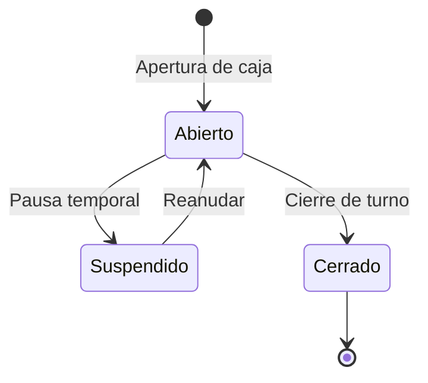
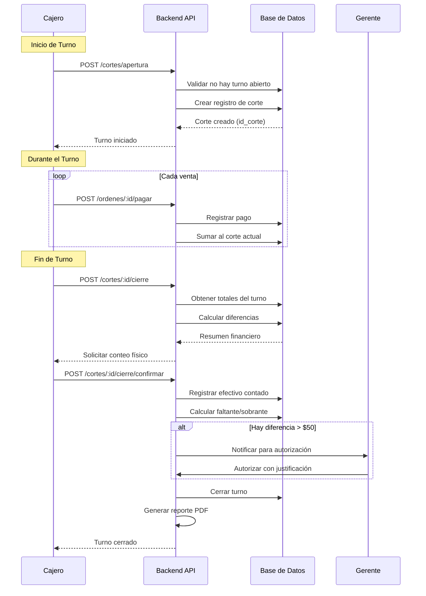

# Proceso de Cortes de Caja

## Descripción General

El módulo de cortes de caja controla el flujo de efectivo del restaurante, gestionando turnos de trabajo, ingresos por ventas, gastos operativos y la conciliación diaria de caja.

## Actores

- **Cajero**: Opera la caja durante su turno
- **Gerente**: Supervisa y autoriza cortes
- **Administrador**: Acceso total y reportes financieros
- **Sistema**: Cálculos automáticos y validaciones

## Ciclo de Vida de un Turno



## Flujo Principal de Apertura y Cierre



## Estados de un Corte

| Estado         | Descripción                   | Operaciones Permitidas   |
| -------------- | ----------------------------- | ------------------------ |
| **Abierto**    | Turno activo, caja operando   | Registrar ventas, gastos |
| **Suspendido** | Pausa temporal (ej: break)    | Reanudar, consultar      |
| **Cerrado**    | Turno finalizado y conciliado | Solo lectura             |

## Operaciones Principales

### 1. Apertura de Caja

**Endpoint**: `POST /cortes/apertura`

**Permisos**: Cajero, Gerente, Administrador

**Request Body**:

```json
{
  "monto_inicial": 500.0,
  "billetes": {
    "1000": 0,
    "500": 1,
    "200": 0,
    "100": 0,
    "50": 0,
    "20": 0
  },
  "monedas": {
    "10": 0,
    "5": 0,
    "2": 0,
    "1": 0
  }
}
```

**Validaciones**:

- No debe haber otro turno abierto del mismo usuario
- El monto inicial debe coincidir con el desglose
- Monto inicial típico: $500 - $2000

**Response**:

```json
{
  "id_corte": 145,
  "folio": "CORTE-2025-145",
  "fecha_apertura": "2025-10-08T08:00:00Z",
  "monto_inicial": 500.0,
  "estado": "abierto",
  "cajero": {
    "nombre": "María López"
  }
}
```

### 2. Registrar Venta

**Proceso Automático** al pagar una orden:

```typescript
async registrarVenta(pago: Pago) {
  const corteActivo = await this.obtenerCorteActivo(pago.id_usuario);

  if (!corteActivo) {
    throw new BadRequestException('No hay turno abierto');
  }

  await this.prisma.$transaction(async (tx) => {
    // Actualizar totales del corte
    await tx.cortes_caja.update({
      where: { id_corte: corteActivo.id_corte },
      data: {
        total_ventas: { increment: pago.monto },
        total_efectivo: pago.metodo === 'efectivo'
          ? { increment: pago.monto }
          : undefined,
        total_tarjeta: pago.metodo === 'tarjeta'
          ? { increment: pago.monto }
          : undefined,
      }
    });

    // Registrar movimiento
    await tx.movimientos_caja.create({
      data: {
        id_corte: corteActivo.id_corte,
        tipo: 'ingreso',
        concepto: 'venta',
        monto: pago.monto,
        metodo_pago: pago.metodo,
        referencia: `Orden ${pago.id_orden}`
      }
    });
  });
}
```

### 3. Registrar Gasto

**Endpoint**: `POST /cortes/:id/gastos`

**Permisos**: Gerente, Administrador

**Request Body**:

```json
{
  "concepto": "Compra de gas",
  "monto": 350.0,
  "categoria": "servicios",
  "metodo_pago": "efectivo",
  "comprobante": "FACT-2025-456",
  "notas": "Cilindro de 30kg"
}
```

**Categorías de Gastos**:

- `servicios`: Luz, agua, gas, internet
- `insumos`: Productos de limpieza, desechables
- `mantenimiento`: Reparaciones, mantenimiento
- `nomina`: Pagos a empleados
- `otros`: Gastos varios

**Validaciones**:

- El monto no debe exceder el efectivo disponible
- Gastos > $1000 requieren comprobante
- Gastos > $5000 requieren autorización de Administrador

### 4. Consultar Estado de Caja

**Endpoint**: `GET /cortes/activo`

**Response**:

```json
{
  "id_corte": 145,
  "fecha_apertura": "2025-10-08T08:00:00Z",
  "monto_inicial": 500.0,
  "totales": {
    "ventas": 12450.0,
    "gastos": 850.0,
    "propinas": 1240.0,
    "efectivo": 8320.0,
    "tarjeta": 4130.0,
    "transferencia": 0.0
  },
  "ordenes_pendientes": 3,
  "ultima_venta": "2025-10-08T16:45:00Z"
}
```

### 5. Cierre de Turno

**Endpoint**: `POST /cortes/:id/cierre`

**Paso 1: Iniciar Cierre**

```json
{
  "efectivo_contado": 8820.0,
  "desglose_billetes": {
    "1000": 5,
    "500": 6,
    "200": 4,
    "100": 5,
    "50": 2,
    "20": 6
  },
  "desglose_monedas": {
    "10": 10,
    "5": 4,
    "2": 0,
    "1": 0
  }
}
```

**Paso 2: Cálculo Automático**

```typescript
calcularCierre(corte: Corte, efectivoContado: number) {
  const efectivoEsperado =
    corte.monto_inicial +
    corte.total_efectivo -
    corte.total_gastos_efectivo;

  const diferencia = efectivoContado - efectivoEsperado;

  return {
    efectivo_esperado: efectivoEsperado,
    efectivo_contado: efectivoContado,
    diferencia: diferencia,
    tipo_diferencia: diferencia > 0 ? 'sobrante' : 'faltante',
    requiere_autorizacion: Math.abs(diferencia) > 50
  };
}
```

**Paso 3: Autorización (si aplica)**

Si `|diferencia| > $50`:

- Se notifica al Gerente/Administrador
- Se requiere justificación
- Se puede rechazar el cierre y solicitar reconteo

**Response**:

```json
{
  "resumen": {
    "total_ventas": 12450.0,
    "total_gastos": 850.0,
    "efectivo_esperado": 8320.0,
    "efectivo_contado": 8820.0,
    "diferencia": 500.0,
    "tipo": "sobrante",
    "estado": "pendiente_autorizacion"
  },
  "detalle_metodos_pago": {
    "efectivo": 8320.0,
    "tarjeta": 4130.0
  },
  "ordenes_procesadas": 87,
  "ticket_promedio": 143.1
}
```

## Tipos de Movimientos de Caja

### Ingresos

- **Ventas**: Pagos de órdenes
- **Propinas**: Propinas recibidas
- **Devoluciones de gastos**: Reintegros
- **Otros ingresos**: Diversos

### Egresos

- **Gastos operativos**: Servicios, insumos
- **Retiros**: Envío a banco/bóveda
- **Devoluciones**: Reembolsos a clientes
- **Otros egresos**: Diversos

## Reportes Financieros

### 1. Reporte Diario

**Endpoint**: `GET /cortes/reporte-diario`

**Query Params**: `fecha=2025-10-08`

**Incluye**:

- Total de ventas por turno
- Ventas por método de pago
- Gastos del día
- Diferencias en cortes
- Ticket promedio

### 2. Reporte Semanal

**Endpoint**: `GET /cortes/reporte-semanal`

**Análisis**:

- Ventas por día de la semana
- Comparativa con semana anterior
- Tendencias de ventas
- Gastos recurrentes

### 3. Reporte Mensual

**Endpoint**: `GET /cortes/reporte-mensual`

**Incluye**:

- Total de ventas del mes
- Comparativa vs mes anterior
- Gastos por categoría
- Gráficas de tendencias
- Análisis de rentabilidad

### 4. Historial de Cortes

**Endpoint**: `GET /cortes/historial`

**Filtros**:

- Rango de fechas
- Usuario (cajero)
- Estado del corte

**Response**:

```json
{
  "cortes": [
    {
      "folio": "CORTE-2025-145",
      "fecha_apertura": "2025-10-08T08:00:00Z",
      "fecha_cierre": "2025-10-08T20:00:00Z",
      "cajero": "María López",
      "total_ventas": 12450.0,
      "diferencia": 0.0,
      "estado": "cerrado"
    }
  ],
  "totales": {
    "ventas_periodo": 124500.0,
    "promedio_diario": 17785.71
  }
}
```

## Dashboard de Caja en Tiempo Real

**Endpoint**: `GET /cortes/dashboard`

**Métricas en Tiempo Real**:

```json
{
  "turno_actual": {
    "tiempo_transcurrido": "8h 30m",
    "ventas_hora": 1556.25,
    "ordenes_procesadas": 87,
    "efectivo_caja": 8320.0
  },
  "comparativa": {
    "vs_mismo_dia_semana_anterior": "+15.5%",
    "vs_promedio_diario": "+8.2%"
  },
  "proyeccion": {
    "ventas_estimadas_fin_turno": 14200.0
  }
}
```

## Reglas de Negocio

### 1. Un Usuario = Un Turno

**Regla**: Un usuario solo puede tener un turno abierto a la vez

**Validación**:

```typescript
const turnoAbierto = await prisma.cortes_caja.findFirst({
  where: {
    id_usuario: userId,
    estado: 'abierto',
  },
});

if (turnoAbierto) {
  throw new BadRequestException('Ya tienes un turno abierto');
}
```

### 2. Órdenes Sin Cerrar

**Regla**: No se puede cerrar turno con órdenes pendientes de pago

**Validación**:

```typescript
const ordenesPendientes = await prisma.ordenes.count({
  where: {
    id_usuario_creacion: userId,
    id_estado_orden: { not: ESTADO_PAGADO },
    created_at: { gte: corte.fecha_apertura },
  },
});

if (ordenesPendientes > 0) {
  throw new BadRequestException(`Hay ${ordenesPendientes} órdenes sin cerrar`);
}
```

### 3. Tolerancia en Diferencias

**Regla**: Diferencias menores a $50 son aceptables automáticamente

```typescript
const TOLERANCIA = 50;

if (Math.abs(diferencia) <= TOLERANCIA) {
  // Auto-aprobar
  corte.estado = 'cerrado';
} else {
  // Requiere autorización
  corte.estado = 'pendiente_autorizacion';
  notificarGerente(corte);
}
```

### 4. Retiro de Efectivo

**Regla**: Cuando el efectivo excede $10,000, se debe hacer retiro

**Proceso**:

1. Gerente autoriza retiro
2. Se registra monto a retirar
3. Se genera comprobante
4. Se actualiza efectivo en caja
5. Se envía a banco/bóveda

## Conciliación Bancaria

### Proceso de Conciliación de Tarjetas

1. Obtener reporte del TPV (Terminal Punto de Venta)
2. Comparar con totales del sistema
3. Identificar diferencias
4. Investigar transacciones faltantes
5. Ajustar si es necesario

**Endpoint**: `POST /cortes/conciliacion-tarjetas`

```json
{
  "fecha": "2025-10-08",
  "total_tpv": 4130.0,
  "total_sistema": 4130.0,
  "diferencia": 0.0,
  "transacciones_tpv": 32,
  "transacciones_sistema": 32
}
```

## Auditoría y Seguridad

### Trazabilidad

Todos los movimientos de caja registran:

- Timestamp exacto
- Usuario responsable
- Monto antes/después
- Justificación (si aplica)
- IP del dispositivo

### Logs de Acceso

```typescript
await registrarLog({
  accion: 'APERTURA_CAJA',
  usuario: userId,
  detalles: {
    monto_inicial: 500,
    hora: new Date(),
  },
});
```

## Indicadores de Desempeño (KPIs)

### Operativos

- **Tiempo promedio de turno**: 8-12 horas
- **Ventas por hora**: Variable según turno
- **Ticket promedio**: Meta según tipo de restaurante
- **Órdenes por hora**: Indicador de eficiencia

### Financieros

- **Margen de utilidad**: (Ventas - Gastos) / Ventas
- **Rotación de efectivo**: Veces que se retira efectivo
- **Diferencias acumuladas**: Meta: < 0.5% de ventas totales

## Troubleshooting

### Turno no se puede cerrar

**Posibles causas**:

1. Órdenes pendientes sin pagar
2. Errores en cálculo de totales
3. Falta autorización de diferencia

**Solución**:

```typescript
// Verificar órdenes pendientes
GET /ordenes?estado=pendiente&usuario=:userId

// Forzar recalculo de totales
POST /cortes/:id/recalcular

// Solicitar autorización
POST /cortes/:id/solicitar-autorizacion
```

### Diferencia significativa en efectivo

**Investigación**:

1. Revisar último movimiento antes de la diferencia
2. Verificar cambios dados correctamente
3. Revisar transacciones canceladas
4. Contar nuevamente efectivo físico

**Registro**:

```json
{
  "investigacion": {
    "fecha": "2025-10-08",
    "diferencia": 500.0,
    "posible_causa": "Cambio mal dado en orden #1523",
    "accion_correctiva": "Capacitación en manejo de efectivo"
  }
}
```
