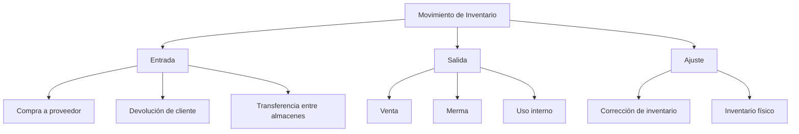
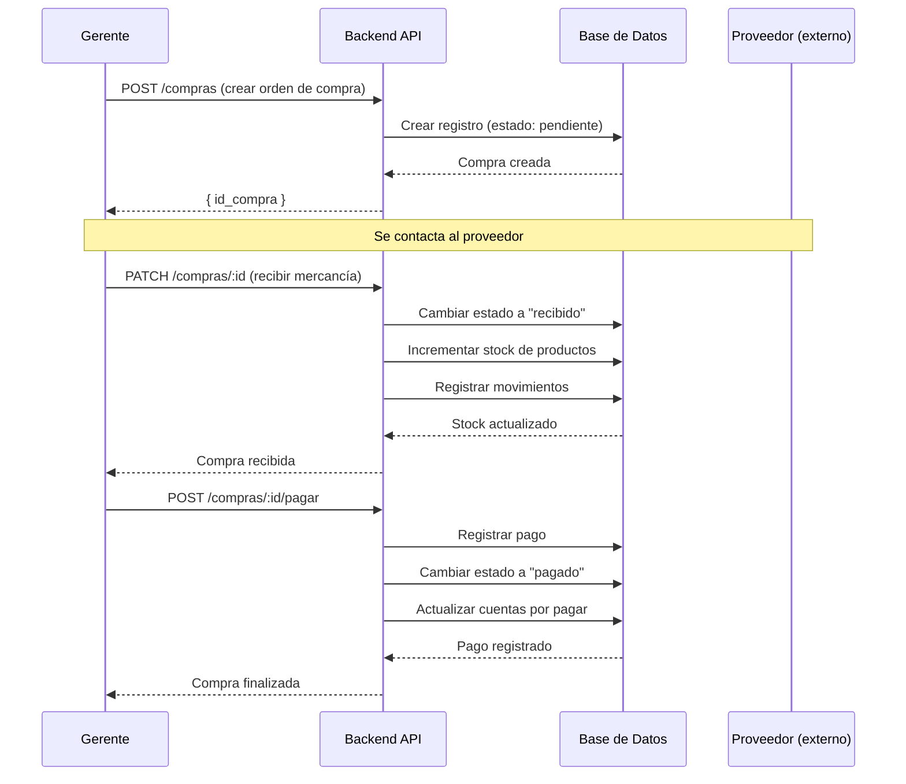

# Proceso de Inventario

## Descripción General

El módulo de inventario controla las existencias de productos, materias primas e insumos del restaurante, incluyendo compras a proveedores, movimientos internos y alertas de stock.

## Actores

- **Administrador**: Control total del inventario
- **Gerente**: Gestión de compras y revisión de stock
- **Cajero**: Consulta de existencias
- **Sistema**: Alertas automáticas y actualizaciones

## Tipos de Movimientos



## Flujo Principal de Compra



## Estados de una Compra

| Estado        | Descripción                       | Afecta Inventario |
| ------------- | --------------------------------- | ----------------- |
| **Pendiente** | Orden creada, esperando mercancía | ❌                |
| **Recibido**  | Mercancía recibida y verificada   | ✅                |
| **Pagado**    | Compra pagada completamente       | ✅                |
| **Cancelado** | Compra cancelada                  | ❌                |

## Operaciones Principales

### 1. Crear Compra

**Endpoint**: `POST /compras`

**Permisos**: Gerente, Administrador

**Request Body**:

```json
{
  "id_proveedor": 5,
  "fecha_compra": "2025-10-08",
  "items": [
    {
      "id_producto": 12,
      "cantidad": 50,
      "precio_unitario": 25.0
    },
    {
      "id_producto": 15,
      "cantidad": 30,
      "precio_unitario": 15.5
    }
  ],
  "notas": "Entrega urgente"
}
```

**Response**:

```json
{
  "id_compra": 45,
  "folio": "COMP-2025-045",
  "estado": "pendiente",
  "total": 1715.0,
  "proveedor": {
    "nombre": "Abarrotes del Centro"
  }
}
```

### 2. Recibir Mercancía

**Endpoint**: `PATCH /compras/:id/recibir`

**Request Body**:

```json
{
  "items_recibidos": [
    {
      "id_detalle": 89,
      "cantidad_recibida": 50
    },
    {
      "id_detalle": 90,
      "cantidad_recibida": 28
    }
  ],
  "notas": "Faltaron 2 unidades del segundo producto"
}
```

**Proceso**:

1. Validar que la compra esté en estado "pendiente"
2. Comparar cantidades recibidas vs solicitadas
3. Si hay diferencias, registrar en `discrepancias`
4. Actualizar stock de cada producto
5. Crear movimientos de inventario tipo "entrada"
6. Cambiar estado de compra a "recibido"
7. Actualizar `fecha_recepcion`

### 3. Consultar Stock

**Endpoint**: `GET /inventario/stock`

**Query Params**:

- `categoria`: Filtrar por categoría
- `minimo`: Solo productos bajo stock mínimo
- `proveedor`: Productos de un proveedor

**Response**:

```json
{
  "productos": [
    {
      "id_producto": 12,
      "nombre": "Tomate",
      "stock_actual": 15,
      "stock_minimo": 20,
      "unidad": "kg",
      "alerta": true,
      "ultimo_movimiento": "2025-10-07T10:30:00Z"
    }
  ]
}
```

### 4. Ajustar Inventario

**Endpoint**: `POST /inventario/ajuste`

**Permisos**: Gerente, Administrador

**Request Body**:

```json
{
  "id_producto": 12,
  "cantidad_nueva": 18,
  "motivo": "Inventario físico",
  "notas": "Conteo físico mensual"
}
```

**Validaciones**:

- Requiere motivo válido
- Genera movimiento tipo "ajuste"
- Registra diferencia (positiva o negativa)

### 5. Registrar Merma

**Endpoint**: `POST /inventario/merma`

**Request Body**:

```json
{
  "id_producto": 8,
  "cantidad": 5,
  "motivo": "Producto caducado",
  "responsable": "Juan Pérez"
}
```

**Proceso**:

1. Validar que haya stock suficiente
2. Reducir stock
3. Crear movimiento tipo "salida - merma"
4. Registrar en reporte de mermas

## Sistema de Alertas

### Tipos de Alertas

1. **Stock Bajo**
   - Trigger: `stock_actual < stock_minimo`
   - Acción: Notificación a Gerente
   - Frecuencia: Diaria (9:00 AM)

2. **Stock Crítico**
   - Trigger: `stock_actual < (stock_minimo * 0.5)`
   - Acción: Notificación urgente
   - Frecuencia: Inmediata

3. **Producto Sin Movimiento**
   - Trigger: Sin movimiento en 30 días
   - Acción: Revisión de inventario
   - Frecuencia: Semanal

4. **Producto Próximo a Caducar**
   - Trigger: `fecha_caducidad < NOW() + 7 days`
   - Acción: Alerta para uso prioritario
   - Frecuencia: Diaria

### Configuración de Alertas

```typescript
// Ejemplo de configuración
{
  id_producto: 12,
  stock_minimo: 20,
  stock_maximo: 100,
  punto_reorden: 30, // Cuando llega aquí, crear orden de compra sugerida
  dias_caducidad_alerta: 7
}
```

## Valorización de Inventario

### Métodos Soportados

1. **PEPS (Primero en Entrar, Primero en Salir)**
   - Método por defecto
   - Refleja flujo físico real
   - Mejor para productos perecederos

2. **Promedio Ponderado**
   - Opcional por producto
   - Simplifica cálculos
   - Útil para productos no perecederos

### Cálculo de Costo Promedio

```typescript
calcularCostoPromedio(producto) {
  const entradas = obtenerEntradas(producto);

  let costoTotal = 0;
  let cantidadTotal = 0;

  for (const entrada of entradas) {
    costoTotal += entrada.cantidad * entrada.precio_unitario;
    cantidadTotal += entrada.cantidad;
  }

  return cantidadTotal > 0 ? costoTotal / cantidadTotal : 0;
}
```

## Reportes de Inventario

### 1. Reporte de Existencias

**Endpoint**: `GET /inventario/reportes/existencias`

**Incluye**:

- Stock actual por producto
- Valor total del inventario
- Productos con alerta
- Últimos movimientos

### 2. Reporte de Movimientos

**Endpoint**: `GET /inventario/reportes/movimientos`

**Query Params**:

- `fecha_inicio`: Fecha inicial
- `fecha_fin`: Fecha final
- `tipo`: Tipo de movimiento
- `producto`: ID del producto

**Response**:

```json
{
  "movimientos": [
    {
      "fecha": "2025-10-08T14:30:00Z",
      "tipo": "entrada",
      "producto": "Tomate",
      "cantidad": 50,
      "costo_unitario": 25.0,
      "responsable": "Juan Pérez"
    }
  ],
  "resumen": {
    "total_entradas": 150,
    "total_salidas": 85,
    "diferencia": 65
  }
}
```

### 3. Análisis ABC

Clasificación de productos por valor de inventario:

- **Clase A**: 80% del valor (20% de productos)
- **Clase B**: 15% del valor (30% de productos)
- **Clase C**: 5% del valor (50% de productos)

### 4. Reporte de Mermas

**Análisis de pérdidas**:

- Mermas por producto
- Mermas por categoría
- Tendencias mensuales
- Costos de merma

## Integración con Proveedores

### Historial de Compras por Proveedor

**Endpoint**: `GET /proveedores/:id/historial-compras`

**Response**:

```json
{
  "proveedor": "Abarrotes del Centro",
  "compras": [
    {
      "folio": "COMP-2025-045",
      "fecha": "2025-10-08",
      "total": 1715.0,
      "estado": "pagado"
    }
  ],
  "estadisticas": {
    "total_comprado": 45230.0,
    "compras_ultimo_mes": 5,
    "promedio_compra": 9046.0,
    "dias_promedio_pago": 15
  }
}
```

### Productos por Proveedor

Cada producto puede tener múltiples proveedores con:

- Precio por proveedor
- Tiempo de entrega
- Calificación (1-5 estrellas)
- Producto preferido (flag)

## Reglas de Negocio

### 1. Control de Stock Negativo

**Regla**: El stock nunca puede ser negativo

**Validación**:

```typescript
if (stockActual - cantidad < 0) {
  throw new BadRequestException(
    'Stock insuficiente. Disponible: ' + stockActual,
  );
}
```

### 2. Compras Sin Recibir

**Regla**: No se puede pagar una compra sin haberla recibido

**Validación**:

```typescript
if (compra.estado !== 'recibido') {
  throw new BadRequestException('Debe recibir la mercancía antes de pagar');
}
```

### 3. Ajustes Significativos

**Regla**: Ajustes > 10% requieren justificación adicional

**Proceso**:

```typescript
const diferencia = Math.abs(cantidadNueva - stockActual);
const porcentaje = (diferencia / stockActual) * 100;

if (porcentaje > 10 && !dto.autorizacion_gerente) {
  throw new BadRequestException(
    'Ajuste mayor al 10% requiere autorización de gerente',
  );
}
```

### 4. Productos Inactivos

**Regla**: Productos inactivos no pueden venderse ni comprarse

**Validación**: Se verifica el campo `activo` antes de operaciones

## Auditoría de Inventario

### Trazabilidad Completa

Cada movimiento registra:

- Fecha y hora exacta
- Usuario responsable
- Tipo de movimiento
- Cantidad antes/después
- Costo asociado
- Documento de respaldo (si aplica)

### Inventario Físico

**Proceso Mensual**:

1. Gerente programa fecha de conteo
2. Se genera lista de productos a contar
3. Personal realiza conteo físico
4. Se compara con sistema
5. Se registran diferencias
6. Se aprueban ajustes
7. Se genera reporte final

**Endpoint**: `POST /inventario/fisico`

```json
{
  "fecha_conteo": "2025-10-31",
  "productos_contados": [
    {
      "id_producto": 12,
      "cantidad_sistema": 25,
      "cantidad_fisica": 23,
      "diferencia": -2
    }
  ]
}
```

## Optimización de Stock

### Punto de Reorden Automático

```typescript
puntoReorden = demandaDiaria * tiempoEntrega + stockSeguridad;

// Ejemplo:
// Demanda diaria: 10 unidades
// Tiempo de entrega: 3 días
// Stock de seguridad: 5 unidades
// Punto de reorden: (10 * 3) + 5 = 35 unidades
```

### Cantidad Económica de Pedido (EOQ)

```typescript
EOQ = sqrt((2 * demandaAnual * costoPedido) / costoAlmacenamiento);
```

## Troubleshooting

### Stock no coincide con conteo físico

**Causa**: Ventas no registradas o mermas no reportadas

**Solución**:

1. Revisar últimos movimientos
2. Verificar órdenes sin cerrar
3. Realizar ajuste con justificación
4. Investigar causa raíz

### Alerta de stock bajo no se genera

**Causa**: `stock_minimo` no configurado

**Solución**:

```sql
UPDATE productos
SET stock_minimo = 20
WHERE id_producto = 12;
```

### Proveedor sin historial de compras

**Causa**: Compras no vinculadas correctamente

**Solución**: Verificar campo `id_proveedor` en tabla `compras`
