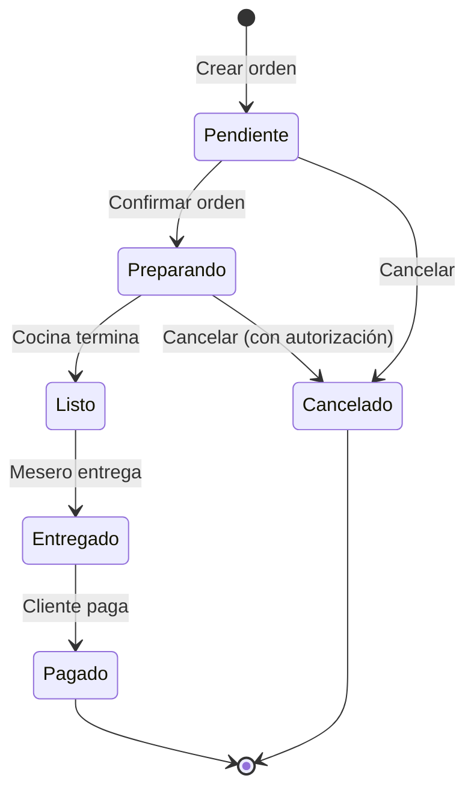
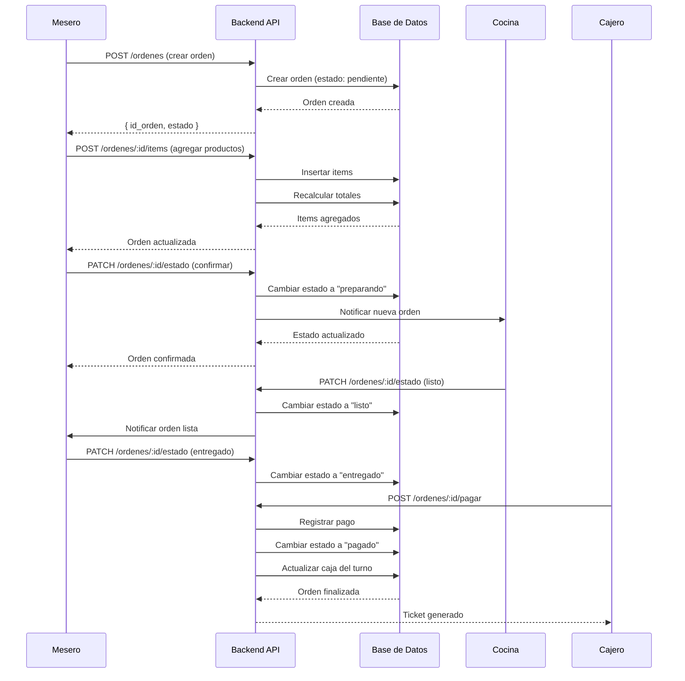

# Proceso de Órdenes

## Descripción General

El módulo de órdenes gestiona todo el ciclo de vida de un pedido en el restaurante, desde su creación hasta su finalización y pago.

## Actores

- **Mesero**: Crea y gestiona órdenes
- **Cocinero**: Prepara los platillos
- **Cajero**: Procesa pagos y cierra órdenes
- **Sistema**: Automatiza cambios de estado y notificaciones

## Estados de una Orden



### Descripción de Estados

| Estado         | Descripción                     | Acciones Permitidas                             |
| -------------- | ------------------------------- | ----------------------------------------------- |
| **Pendiente**  | Orden creada, aún sin confirmar | Agregar/eliminar items, asignar mesa, confirmar |
| **Preparando** | Orden en cocina                 | Ver progreso, cancelar con autorización         |
| **Listo**      | Orden lista para entregar       | Marcar como entregada                           |
| **Entregado**  | Orden servida al cliente        | Procesar pago                                   |
| **Pagado**     | Orden completada y pagada       | Generar ticket, cerrar                          |
| **Cancelado**  | Orden cancelada                 | Ver motivo de cancelación                       |

## Flujo Principal



## Operaciones CRUD

### 1. Crear Orden

**Endpoint**: `POST /ordenes`

**Permisos**: Cajero, Mesero, Gerente, Administrador

**Request Body**:

```json
{
  "id_mesa": 5,
  "id_cliente": null,
  "notas": "Sin cebolla"
}
```

**Response**:

```json
{
  "id_orden": 123,
  "numero_orden": "ORD-001",
  "fecha_hora_creacion": "2025-10-08T14:30:00Z",
  "estado": "pendiente",
  "total": 0,
  "subtotal": 0
}
```

### 2. Agregar Items a la Orden

**Endpoint**: `POST /ordenes/:id/items`

**Request Body**:

```json
{
  "id_producto": 45,
  "cantidad": 2,
  "precio_unitario": 150.0,
  "notas": "Bien cocido"
}
```

**Validaciones**:

- La orden debe estar en estado "pendiente"
- El producto debe existir y estar activo
- La cantidad debe ser mayor a 0
- El precio no puede ser negativo

### 3. Eliminar Item de la Orden

**Endpoint**: `DELETE /ordenes/:id/items/:itemId`

**Restricciones**:

- Solo se pueden eliminar items en estado "pendiente"
- Si es el último item, se debe eliminar toda la orden

### 4. Cambiar Estado de Orden

**Endpoint**: `PATCH /ordenes/:id/estado`

**Request Body**:

```json
{
  "id_estado_orden": 2,
  "notas": "Cliente solicita cambio"
}
```

**Validaciones de Transición**:

- Pendiente → Preparando ✅
- Preparando → Listo ✅
- Listo → Entregado ✅
- Entregado → Pagado ✅
- Cualquier estado → Cancelado ✅ (con autorización)
- ❌ No se permite retroceder estados

### 5. Procesar Pago

**Endpoint**: `POST /ordenes/:id/pagar`

**Request Body**:

```json
{
  "metodo_pago": "efectivo",
  "monto_recibido": 500.0,
  "propina": 50.0
}
```

**Proceso**:

1. Validar que la orden esté en estado "entregado"
2. Calcular cambio si aplica
3. Registrar pago en tabla `pagos`
4. Cambiar estado a "pagado"
5. Actualizar el total del corte de caja actual
6. Generar ticket/recibo

## Cálculo de Totales

```typescript
// Pseudocódigo
calcularTotales(orden) {
  subtotal = suma(items.precio_unitario * items.cantidad)
  descuento = aplicarDescuentos(orden)
  impuestos = subtotal * 0.16 // IVA 16%
  propina = orden.propina || 0

  total = subtotal - descuento + impuestos + propina

  return { subtotal, descuento, impuestos, propina, total }
}
```

## Reglas de Negocio

### Validaciones Críticas

1. **Una orden debe tener al menos un item**
   - Al eliminar el último item, se elimina la orden completa

2. **No se pueden modificar órdenes pagadas**
   - Una vez pagada, la orden es inmutable

3. **Control de concurrencia**
   - Si dos meseros intentan modificar la misma orden, gana el primero
   - Se usa `updated_at` para detectar conflictos

4. **Cancelación de órdenes**
   - Órdenes "pendientes": cualquier mesero puede cancelar
   - Órdenes "preparando" o posteriores: requiere autorización de Gerente/Admin

5. **Timestamps automáticos**
   - `fecha_hora_creacion`: al crear
   - `fecha_hora_preparacion`: al cambiar a "preparando"
   - `fecha_hora_listo`: al cambiar a "listo"
   - `fecha_hora_entrega`: al cambiar a "entregado"
   - `fecha_hora_pago`: al pagar

## Casos de Uso Especiales

### Modificar Orden en Preparación

Si un cliente solicita cambios después de confirmar:

1. Gerente/Admin debe autorizar
2. Se crea un registro en `historial_cambios`
3. Se notifica a cocina del cambio
4. Se recalculan totales

### Dividir Cuenta

1. Se crea una nueva orden por cada división
2. Se copian los items correspondientes
3. Se recalculan totales para cada orden
4. Se vinculan con la orden original (campo `id_orden_padre`)

### Orden para Llevar

1. Se marca la orden con `tipo = "para_llevar"`
2. No se asigna mesa
3. El flujo de estados es el mismo
4. Se empaqueta al cambiar a "listo"

## Notificaciones

### Eventos que Generan Notificaciones

| Evento                 | Destino          | Método                |
| ---------------------- | ---------------- | --------------------- |
| Nueva orden confirmada | Cocina           | WebSocket / Impresora |
| Orden lista            | Mesero           | WebSocket / App móvil |
| Orden cancelada        | Cocina + Gerente | WebSocket + Email     |
| Pago procesado         | Contabilidad     | Registro en DB        |

## Métricas y KPIs

### Tiempos Promedio

```sql
-- Tiempo promedio de preparación
SELECT AVG(
  EXTRACT(EPOCH FROM (fecha_hora_listo - fecha_hora_preparacion)) / 60
) AS minutos_promedio
FROM ordenes
WHERE fecha_hora_listo IS NOT NULL;
```

### Ticket Promedio

```sql
SELECT AVG(total) as ticket_promedio
FROM ordenes
WHERE id_estado_orden = (SELECT id_estado_orden FROM estados_orden WHERE nombre = 'pagado');
```

### Órdenes por Hora

```sql
SELECT
  EXTRACT(HOUR FROM fecha_hora_creacion) as hora,
  COUNT(*) as total_ordenes
FROM ordenes
WHERE DATE(fecha_hora_creacion) = CURRENT_DATE
GROUP BY hora
ORDER BY hora;
```

## Troubleshooting

### Problema: Totales no cuadran

**Causa**: Items eliminados no actualizaron el total

**Solución**: Ejecutar recalculo manual

```typescript
await ordenesService.recalcularTotales(ordenId);
```

### Problema: Orden atascada en "preparando"

**Causa**: Fallo en notificación a cocina

**Solución**:

1. Verificar estado en cocina manualmente
2. Cambiar estado manualmente con autorización
3. Revisar logs de WebSocket/impresora

### Problema: Orden pagada sin cerrar turno

**Causa**: Corte de caja no se ha realizado

**Solución**: El pago se registra en el corte actual, se concilia al cerrar turno
